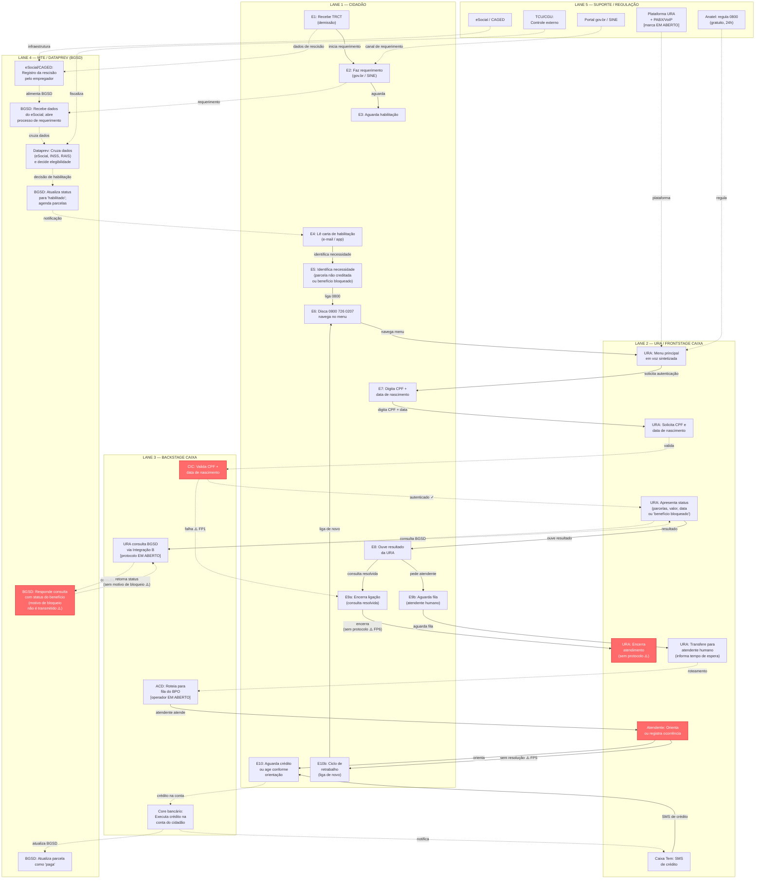
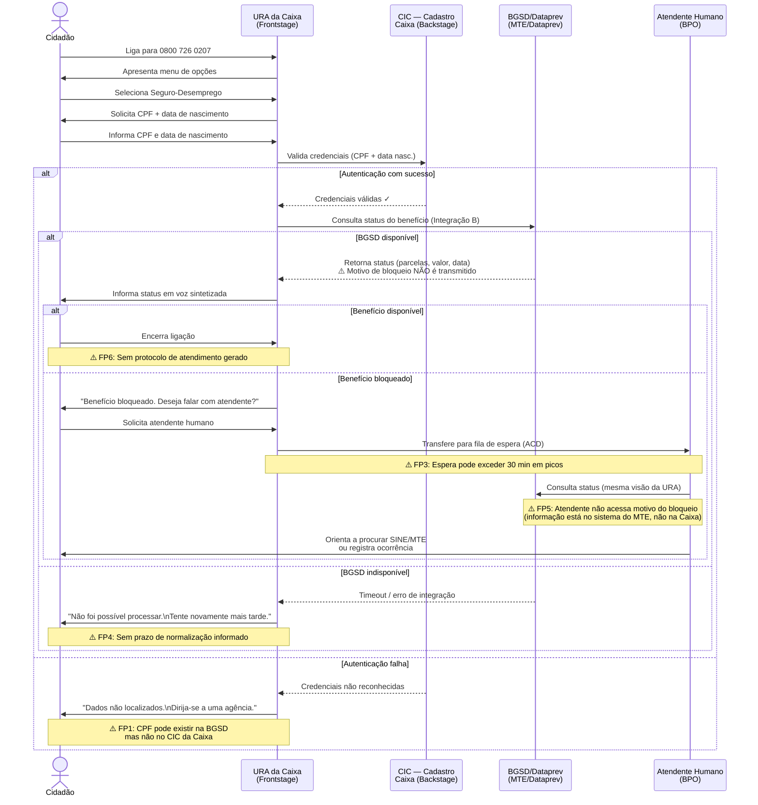
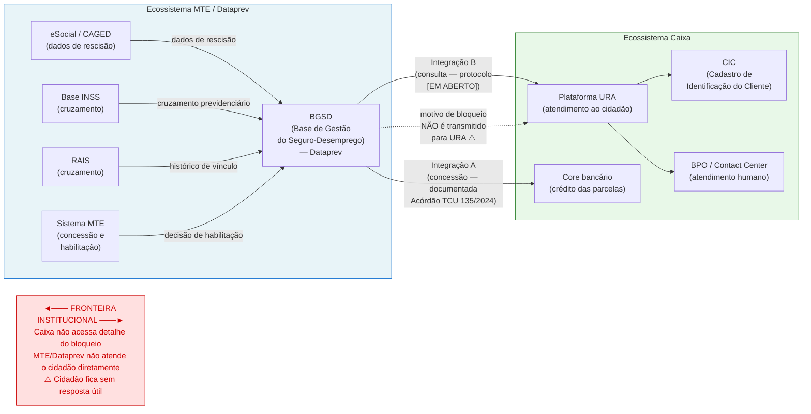

# Diagrama AS-IS — Service Blueprint: URA da Caixa / Seguro-Desemprego

**Fonte:** C_blueprint_asis.md  
**Data:** junho de 2026

---

## Diagrama 1 — Fluxo da Jornada por Swim Lane (Mermaid)

O diagrama abaixo representa as interações entre atores ao longo das 10 etapas da jornada, com setas indicando fluxos de informação, ação e handoff entre swim lanes. As setas tracejadas (- ->) indicam fluxos de dados entre sistemas; as setas sólidas (-->) indicam ações ou transferências iniciadas pelo cidadão ou pela Caixa.

---

## Diagrama 2 — Handoffs Críticos entre Atores (Mermaid — sequência)

Este diagrama de sequência detalha os handoffs mais críticos na Fase 2 (URA), mostrando explicitamente onde as responsabilidades passam de um ator para outro e onde ocorrem os fail points sistêmicos.

---

## Diagrama 3 — Fronteira Institucional e Fluxo de Dados (relação estrutural)

Este diagrama mostra as relações estruturais entre os sistemas de dados, destacando a **fronteira institucional** que é a causa raiz dos fail points FP2b e FP5.

---

## Legenda dos Fail Points no Diagrama

| Símbolo | Fail Point | Etapa | Tipo |
|---------|-----------|-------|------|
| ⚠️ FP0b | Perda do prazo de 120 dias | E2 | Processo/regulatório |
| ⚠️ FP1 | Falha de autenticação (CIC ≠ BGSD) | E7 | Integração de dados |
| ⚠️ FP2b | Bloqueio sem causa explicada | E8 | Fronteira institucional |
| ⚠️ FP3 | Espera >30 min para atendente | E9 | Capacidade operacional |
| ⚠️ FP4 | BGSD indisponível → erro genérico | E8 | Disponibilidade de sistema |
| ⚠️ FP5 | Atendente sem acesso ao motivo do bloqueio | E9 | Fronteira institucional |
| ⚠️ FP6 | URA não emite protocolo de atendimento | E9 | Projeto de sistema |
| ⚠️ FP7 | Conta Caixa inativa → crédito inacessível | E10 | Acesso bancário |
| ⚠️ FP8 | Fragmentação dos canais de reclamação | E10 | Governança regulatória |